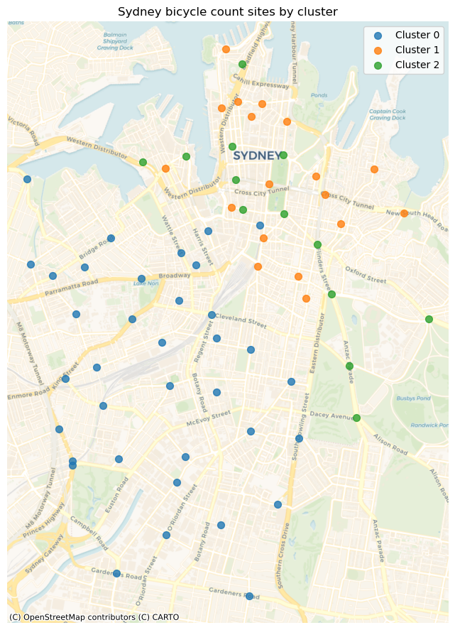
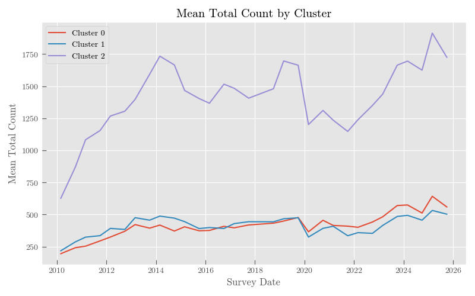
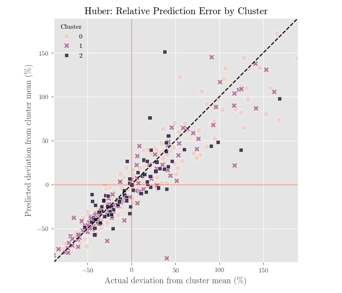

# Sydney Bicycle Counts: Site Segmentation and Predictive Benchmarking

This project analyses Sydney bicycle count survey data using a SQL + Python workflow. The goal is not to build an overclaimed forecasting model, but to construct a clean longitudinal analysis pipeline, segment bicycle count sites into interpretable behavioural groups, and benchmark simple predictive models against transparent lag-based baselines.

The project demonstrates practical data science skills in SQL, panel-data construction, feature engineering, clustering, geospatial visualisation, and out-of-sample model evaluation.

---

## Project Overview

Sydney bicycle count data is collected across survey sites over time, with observations primarily from March and October survey waves. This creates a semiannual site-level panel rather than a dense daily or hourly forecasting dataset.

The analysis focuses on three main questions:

1. Can raw bicycle count survey data be transformed into clean, reusable analytical tables?
2. Can survey sites be grouped into interpretable clusters based on count behaviour and geography?
3. Do simple predictive models improve meaningfully over lag-based baselines?

The main finding is that site behaviour is heterogeneous across Sydney. Some locations behave like high-volume commuter corridors, while others are lower-volume or more mixed-use. For prediction, the Lag-1 baseline is strong, and Huber regression provides only modest improvement. The most useful insight is not the forecasting result itself, but the clearer understanding of site-level behaviour and predictability.

---

## Dataset

The project uses Sydney bicycle count survey data (`Bicycle_count_surveys.csv`) and site metadata (`Bicycle_count_sites.csv`), both obtained from [City of Sydney Open Data portal](https://data.cityofsydney.nsw.gov.au/datasets/cityofsydney::bicycle-count-sites/).

The data has several important characteristics:

- Observations are semiannual, mainly March and October survey waves.
- The bicycle counts are recorded during morning survey windows, 6:00–9:00, and evening survey windows, 16:00–18:00.
- The core unit of analysis is `site_id × survey_date`.
- Site metadata includes location information and coordinates.
- Some sites enter, exit, or have missing observations, so the full panel is unbalanced.
- The data likely contains structural breaks and omitted external factors, including:
  - construction or light rail disruptions around 2015–2017;
  - COVID-era changes around 2020;
  - long-run shifts in population, commuting behaviour, cycling infrastructure, and health habits.

Because of these constraints, prediction is treated as a benchmarking exercise.

---

## Methods and Results

### 1. SQL/Python Panel Construction

The data pipeline was built using DuckDB SQL and Python.

The workflow creates several reusable SQL tables, DataFrames, and GeoDataFrames:

| Table/DF/GDF | Name | Description |
|---|---|---|
| Table | `bike_panel_wide_balanced` | Cleaned panel with one row per `site_id × survey_date` |
| Table | `site_summary_balanced` | One-row-per-site summary table for clustering |
| Table | `cluster_trends_balanced` | Cluster-level trends over time |
| DF | `train` | Training panel for model comparisons |
| DF | `test` | Held-out test panel used to calculate MAE and RMSE |
| GDF | `gdf_sites` | Constructed from `site_summary_balanced` with appropriate CRS projection |

The SQL pipeline handles:

- cleaning and reshaping survey count data;
- joining site metadata and coordinates;
- creating wide panel formats;
- building site-level summary features;
- generating lag features with SQL window functions;
- producing model-ready tables for Python analysis.

---

### 2. Site Clustering

Sites are clustered using a balanced subset of locations with sufficient survey history. Because the project includes a predictive benchmarking component, clustering is fitted using only the training period, defined as observations before 2023. The resulting cluster labels are then treated as fixed site attributes when evaluating later observations.

The clustering features include:

- mean total bicycle count;
- standard deviation of total count;
- morning/evening count ratio;
- March–October count difference;
- projected spatial coordinates.

Because $k$-means relies on Euclidean distance, longitude and latitude are projected into a local metre-based coordinate reference system before clustering. All clustering features are then standardised before fitting $k$-means.

Silhouette scores are calculated as a diagnostic, but the final analysis uses $k = 3$ because it gives the clearest interpretable segmentation.

The clustering analysis shows that bicycle count sites differ meaningfully in volume, variability, seasonal behaviour, and geography. This supports treating sites as distinct behavioural groups rather than assuming one common pattern across all locations.

The clusters are summarised as:

|   Cluster | Interpretation                 |   Mean count |  Std. count |   Morning/Evening ratio |   Mar–Oct difference | Example routes/sites                        |
|----------:|:-------------------------------|-------------:|------------:|------------------------:|---------------------:|:--------------------------------------------|
|         0 | Southwest peripheral sites     |       340.88 |       87.5  |                    0.89 |               -14.92 | Princes Hwy / Parramatta Rd / Eastern Dist  |
|         1 | Inner-city connector streets   |       360.38 |       95.22 |                    0.94 |                 3.92 | Bridge St / Elizabeth St                    |
|         2 | High-volume commuter corridors |      1517.52 |      381.13 |                    1.13 |               -60.67 | Harbour Brg / Pyrmont Brg / Anzac Pde       |

The clusters are visualised on a Sydney map to connect behavioural segments with geography.



The cluster trend plot shows how the training-period cluster groups evolve over the full analysis period.



---

### 3. Predictive Benchmarking

The predictive features are created at the site level:

- `lag_total_1`: previous survey wave;
- `lag_total_2`: previous same-season survey wave;
- `cluster`: the fitted $k$-means cluster label for the site;
- `is_october`: seasonal indicator.

The predictive modelling section compares simple models against lag-based baselines.

The models evaluated are:

| Model | Description |
|---|---|
| Lag-1 baseline | Uses the previous survey wave as the prediction |
| Lag-2 baseline | Uses the previous same-season survey wave as the prediction |
| Linear regression | Linear model using lag and cluster-related features |
| Lasso regression | Regularised linear model |
| Huber regression | Robust linear model less sensitive to large residuals |

Negative percentage changes indicate lower error than the Lag-1 baseline.

The final comparison focuses on held-out later observations. Cluster labels used for predictive benchmarking are treated as fixed site attributes rather than refit using test-period information.

| Model   |    MAE |   RMSE | ΔMAE vs Lag-1  | ΔRMSE vs Lag-1  | Notes                     |
|:--------|-------:|-------:|:---------------|:----------------|:--------------------------|
| Huber   | 111.14 | 208.42 | -5.8%          | -5.3%           | Robust to large residuals |
| Lasso   | 113.29 | 209.59 | -4.0%          | -4.7%           | Regularised linear model  |
| Linear  | 114.3  | 209.99 | -3.1%          | -4.6%           | Lag + cluster features    |
| Lag-1   | 118.01 | 220    | 0.0%           | 0.0%            | Persistence baseline      |
| Lag-2   | 134.8  | 247.41 | 14.2%          | 12.5%           | Same-season baseline      |

A few key observations are below.

#### Lag-1 is a strong baseline

The Lag-1 baseline performs strongly across clusters and is difficult to beat by a large margin. Lag-2 performs worse, suggesting that the previous survey wave contains more useful short-run information than the previous same-season wave.

#### Huber regression provides modest improvement

Huber regression improves on the Lag-1 baseline in some clusters, but the improvement is modest overall. This suggests that linear structure and lag features add some value, but much of the signal is already captured by simple persistence.

|   Cluster |   Observations |   MAE Lag-1 |   MAE Huber |   RMSE Lag-1 |   RMSE Huber |   MAE improvement |   RMSE improvement |
|----------:|---------------:|------------:|------------:|-------------:|-------------:|------------------:|-------------------:|
|         0 |            222 |      80.333 |      74.355 |      112.32  |      105.487 |             5.978 |              6.833 |
|         1 |            108 |      68.935 |      66.888 |      111.232 |      109.306 |             2.047 |              1.926 |
|         2 |             78 |     293.205 |     277.081 |      447.372 |      423.092 |            16.124 |             24.281 |

#### Predictability differs by cluster

Prediction errors are not uniform across site types. The following discussion focuses on Huber regression, the best-performing model in the overall comparison.

Cluster-level errors look different depending on whether error is measured in absolute or relative terms. Cluster 2 has much larger raw MAE and RMSE because it contains high-volume corridor sites. To compare errors across clusters with different count volumes, RMSE is normalised by the corresponding cluster mean count. The median absolute percentage error (APE) is also reported, defined as
$$\text{absolute percentage error} \equiv \left| \frac{\hat{y} - y}{y} \right|.$$

With this, we can interpret the relative measures as:
- `Relative RMSE`: RMSE as a fraction of cluster mean, which punishes large misses;
- `Median APE`: typical percentage error per observation.

The results are below:

|   Cluster |   Observations |   Median APE |   Relative RMSE |
|----------:|---------------:|-------------:|----------------:|
|         0 |            222 |        0.124 |           0.192 |
|         1 |            108 |        0.095 |           0.227 |
|         2 |             78 |        0.116 |           0.252 |

Median APE tells a slightly different story: Cluster 0 has the largest typical percentage error, while Cluster 2 has the largest tail-sensitive error. This suggests that high-volume sites are most exposed to large deviations, while lower-volume sites can still have meaningful relative errors in typical observations.

The final diagnostic plot compares predicted and actual observations after normalising by the corresponding cluster mean count. The line $y = x$ indicates perfect prediction, where predicted and actual values are equal.



---

## Limitations

This project has several important limitations.

- The data is semiannual rather than high-frequency. This limits the ability to model short-term demand variation.
- The panel is unbalanced because not all sites are observed in every survey wave. A balanced subset is used for clustering to improve comparability.
- Several important external drivers are not directly modeled, including:
  - weather;
  - public holidays;
  - construction and light rail disruptions;
  - cycling infrastructure changes;
  - COVID-era behavioural shifts;
  - long-run population and commuting changes.

As a result, remaining prediction error should not be interpreted purely as model failure. Some of it likely reflects omitted variables and structural breaks in the underlying system.

---

## Interactive Power BI Dashboard

[View the interactive Power BI dashboard](https://app.powerbi.com/view?r=eyJrIjoiNGU4NzNkOGYtYmZlYi00NDBkLWEyYzYtZGI4ODYwNzA1ZGM5IiwidCI6ImJiNjc0YWE2LTJhMzItNDA5Zi1iODQ0LTI0NGE4OThjOWM1MyJ9)

---

## Possible Extensions

Possible next steps include:

- adding weather and public holiday features;
- adding infrastructure or construction indicators;
- comparing balanced and unbalanced clustering approaches;
- testing mixed-effects or hierarchical models;
- modelling structural breaks explicitly;
- adding spatial features such as distance to CBD, major roads, or cycleways;
- building an interactive map or dashboard.

---

## Repository Structure

```text
.
├── README.md
├── requirements.txt
│
├── data/
│   ├── counts/
│   ├── sites/
│   ├── transport_project.duckdb
│   └── transport_project.duckdb.wal
│
├── notebooks/
│   ├── 01_data_processing_and_panel_construction.ipynb
│   ├── 02_panel_features_and_clustering.ipynb
│   └── 03_cluster_trends_and_interpretation.ipynb
│
├── outputs/
│   ├── sites_cluster_map.png
│   ├── cluster_trends.png
│   └── predicted_vs_actual.png
│
└── power_bi/
    ├── exports/
    ├── power_bi_data_prep.ipynb
    └── sydney_bicycle.pbix